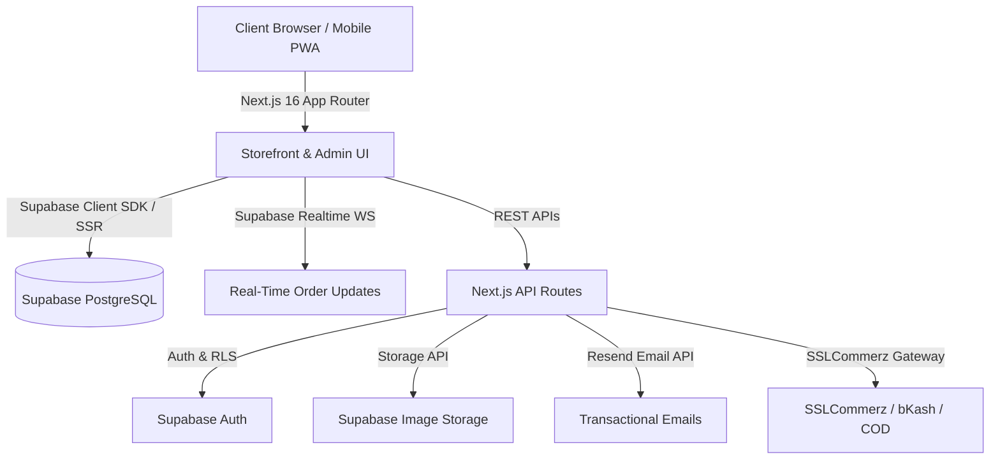

# 🥭 MangoBite — Premium Mangoes & Organic Produce E-Commerce Marketplace

[](https://nextjs.org/)
[](https://www.typescriptlang.org/)
[](https://supabase.com/)
[](https://tailwindcss.com/)
[](https://nextjs.org/)
[](LICENSE)

> **MangoBite** is a full-stack, production-grade e-commerce marketplace built specifically for chemical-free, farm-fresh Rajshahi mangoes and organic produce in Bangladesh. It features a modern customer storefront, real-time order tracking, guest checkout, automated email notifications, a customer loyalty rewards program, and a 16-module admin operations panel.

---

## 🌟 Key Features

### 🛒 Storefront & Customer Experience
* **Dynamic Product Catalog**: Infinite scrolling product grid with category tabs, district origin filters, price range sliders, and debounced search autocomplete with keyboard navigation.
* **Product Detail & Gallery**: High-resolution image zoom lens, full-screen lightbox modal, dynamic weight package pricing (`1kg`, `2kg`, `5kg`, `10kg`, `20kg`), and customer review submission with photo uploads & star distribution.
* **Interactive Shopping Cart**: Selective item checkout checkboxes, in-cart package weight switcher, promo coupon validation (`MANGO10`), delivery fee calculator, and fly-to-cart particle animations.
* **Express Checkout & Guest Mode**: Multi-step checkout with guest order support (no registration required), cascading Bangladesh Division/District/Upazila location selectors, saved address book, and guest order lookup.
* **Real-Time Order Tracking**: Step-by-step progress timeline (Placed → Processed → In Transit → Out for Delivery → Delivered) powered by **Supabase Realtime WebSockets**, with self-service order cancellation.
* **Customer Loyalty & Rewards**: Points engine with Tier progression (Bronze → Silver → Gold → Platinum), points-to-discount conversion, and activity audit history.
* **Product Comparison & Wishlist**: Cross-device server-synced wishlist and side-by-side spec comparison modal for up to 4 items.
* **PDF Invoice Generator**: Client-side printable receipt and auto-downloading PDF invoice generator (`html-to-image` + `jsPDF`).

### 🛠️ 16-Module Admin Operations Suite
* **Real-Time Admin Dashboard**: Live order feed with audio alerts (Web Audio API), revenue area charts, order status breakdown pie charts, and low stock progress indicators.
* **Inventory & Stock Management**: Inline batch stock adjustments, stock increase/decrease audit logging, and low-stock alerts.
* **Order & Customer Operations**: Change order statuses, manual payment status overrides, customer block/unblock controls, and role privileges management.
* **Abandoned Cart Email Recovery**: Scans inactive carts (>24h) and sends automated recovery emails with promo codes (`COMEBACK5`) via Resend API.
* **Content & Banner CMS**: Visual layout manager for storefront hero sliders, promotional cards, and limited-time offer banners.
* **Reports & Analytics**: Time-frame filtered KPI analytics (net revenue, top selling varieties, order volume) with instant CSV report exports.

### 🌐 Localization & PWA
* **Bilingual Support (i18n)**: Instant language switcher between English and Bengali with full RTL text support.
* **Progressive Web App (PWA)**: Offline fallback page (`/offline`), service worker caching, and web app manifest.

---

## 🏗️ System Architecture



---

## 🛠️ Tech Stack & Architecture

* **Framework**: [Next.js 16](https://nextjs.org/) (App Router, Turbopack, Server Actions, Middleware)
* **Language**: [TypeScript](https://www.typescriptlang.org/)
* **Database & Auth**: [Supabase](https://supabase.com/) (PostgreSQL, Row Level Security, Auth, Realtime, Storage)
* **Styling**: [Tailwind CSS v4](https://tailwindcss.com/) & [Lucide Icons](https://lucide.dev/)
* **Data Visualization**: [Recharts](https://recharts.org/)
* **Emails**: [Resend](https://resend.com/) & [React Email](https://react.email/)
* **Payments**: SSLCommerz, Cash on Delivery (COD), Mobile Banking (bKash, Nagad, Rocket)
* **PDF & Printing**: `html-to-image` & `jspdf`

---

## 🚀 Quick Start & Local Setup

### 1. Prerequisites
* **Node.js** >= 18.x
* **npm** or **pnpm** / **yarn**

### 2. Clone & Install Dependencies
```bash
git clone https://github.com/zahidx/mangodb.git
cd mangodb
npm install
```

### 3. Configure Environment Variables
Create a `.env.local` file in the root directory:

```env
# Supabase Configuration
NEXT_PUBLIC_SUPABASE_URL=https://your-supabase-url.supabase.co
NEXT_PUBLIC_SUPABASE_ANON_KEY=your-supabase-anon-key
SUPABASE_SERVICE_ROLE_KEY=your-supabase-service-role-key

# App Configuration
NEXT_PUBLIC_APP_URL=http://localhost:3000
NEXT_PUBLIC_APP_NAME=MangoBite Market

# Optional: Resend Email API
RESEND_API_KEY=re_your_resend_api_key
```

### 4. Run the Development Server
```bash
npm run dev
```
Open [http://localhost:3000](http://localhost:3000) in your browser.

---

## 🔐 Admin Panel Access (Portfolio Demo Mode)

For review and testing, MangoBite includes a built-in admin demo mode:

* **Admin Portal URL**: `http://localhost:3000/admin-login`
* **Demo Username**: `admin`
* **Demo Password**: `admin123`

---

## 📁 Directory Structure

```text
mangobite/
├── messages/                # i18n translation files (en.json, bn.json)
├── public/                  # Static assets, fallback PWA files, icons
├── src/
│   ├── app/                 # Next.js 16 App Router pages & API routes
│   │   ├── (storefront)/    # Cart, checkout, dashboard, products, track, etc.
│   │   ├── admin/           # 16-page Admin Operations Portal
│   │   └── api/             # 36 API Route handlers (admin, auth, carts, payments)
│   ├── components/          # Reusable UI components (Navbar, Footer, Modals)
│   ├── context/             # AuthContext, CartContext, CompareContext, LanguageContext
│   ├── emails/              # React Email templates (OrderReceipt, AbandonedCart)
│   ├── hooks/               # Custom React hooks (useRealtimeOrder, useWishlist)
│   ├── lib/                 # Supabase query library, helper functions
│   └── types/               # TypeScript database schema definitions
└── supabase/
    └── migrations/          # 22 SQL migration files (schema, RLS, functions)
```

---

## 📜 License

Distributed under the MIT License. See `LICENSE` for more information.
